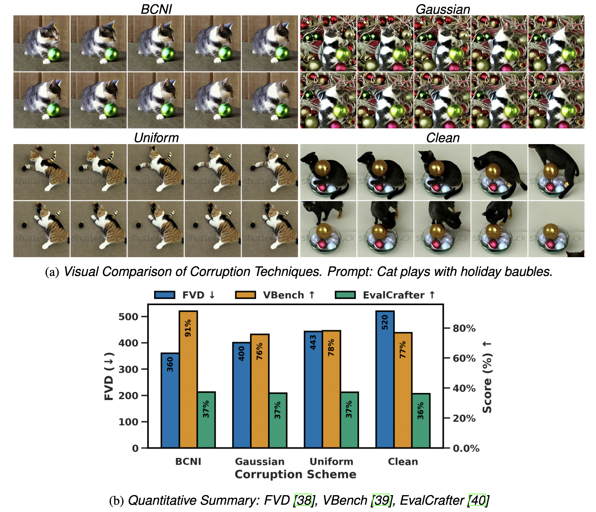
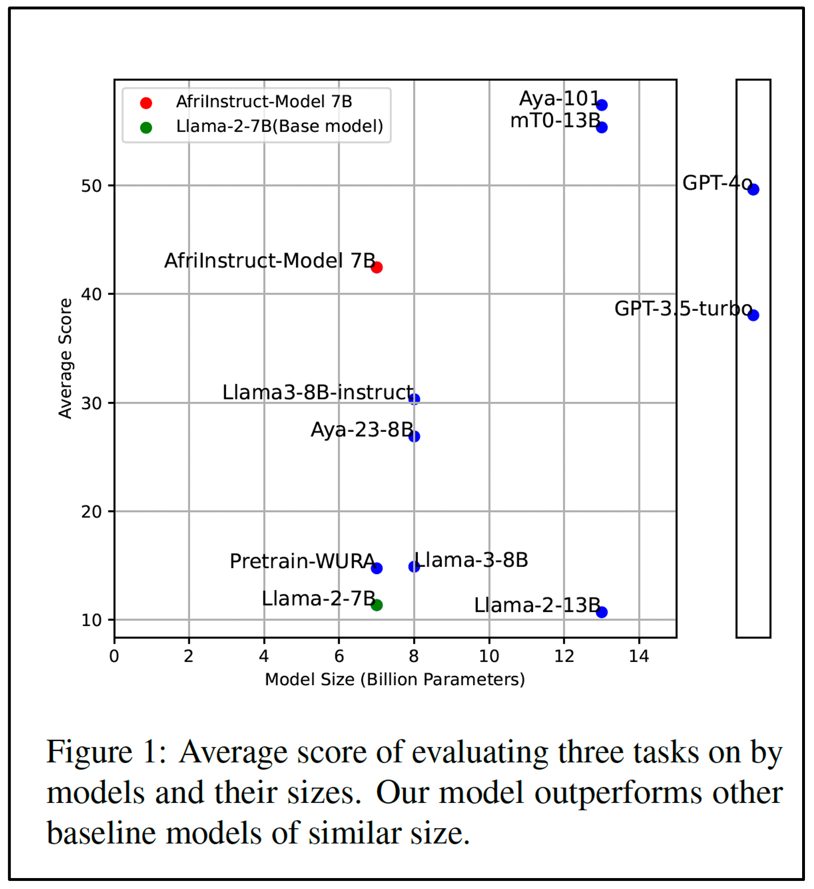

<h3 align="left">
Hi, I am Chika, an AI researcher working on generative modeling, image/video synthesis, and multimodal learning.
</h3>

I am a Ph.D. Researcher at the University of California, Irvine, where I work on generative models, video diffusion, and multimodal learning for scientific and physical systems, advised by 
<a href="https://engineering.uci.edu/users/yoonjin-won" target="_blank">Yoonjin Won</a>.

I received my master’s degree from the Massachusetts Institute of Technology, where I was advised by 
<a href="https://nse.mit.edu/people/matteo-bucci/" target="_blank">Matteo Bucci</a> and 
<a href="https://nse.mit.edu/people/ericmoore-jossou/" target="_blank">Ericmoore Jossou</a>. 
My graduate studies were supported by the 
<a href="https://engineering.mit.edu/graduate/mathworks-fellowships" target="_blank">MathWorks Fellowship</a>. 
I am also a Senior Machine Learning Researcher at William &amp; Mary, where I work under the supervision of 
<a href="https://jd92.wang/" target="_blank">Jindong Wang</a>.

<h3 align="left">🚀 Ongoing/Completed Projects</h3>

1) **CAT-LVDM**: *Robust Video Diffusion via Structured Corruption*  
· [📄 arXiv](https://arxiv.org/abs/2505.21545) · [🧠 Code](https://github.com/chikap421/catlvdm) · [🤗 Checkpoints](https://huggingface.co/Chikap421/catlvdm-checkpoints/tree/main)

  

---
2) **ML4Solar**: *Continental Solar Potential Evaluation Using Machine Learning*  
· [📄 Preprint](https://papers.ssrn.com/sol3/papers.cfm?abstract_id=5171954) · [🧠 Code](https://github.com/chikap421/ml4solar)

  

---

3) **VideoSAM**: *A large vision foundation model for high-speed video segmentation*  
📍 IEEE SSD 2025 · [📄 arXiv](https://arxiv.org/abs/2410.21304) · [🧠 Code](https://github.com/chikap421/videosam)

  

---

4) **AfriInstruct**: *Instruction tuning of African languages for diverse NLP tasks*  
📍 EMNLP 2024 · [📄 Paper](https://aclanthology.org/2024.findings-emnlp.793/) · [🧠 Code](https://github.com/chikap421/AfriInstruct)

  

---

<h3 align="left">🔗 Links</h3>

- 👨‍🎓 Google Scholar: [scholar.google.com/citations?user=YrLydoQAAAAJ](https://scholar.google.com/citations?user=YrLydoQAAAAJ&hl=en)  
- 📧 Email: [chikap421@gmail.com](mailto:chikap421@gmail.com)  
- 🔗 LinkedIn: [linkedin.com/in/mchika](https://www.linkedin.com/in/mchika/)  
- 🧠 Hugging Face: [huggingface.co/Chikap421](https://huggingface.co/Chikap421)  
